# Book Search Engine (MERN stack)

## Description

The GraphQL API has emerged as a framework that allows clients to make flexible/customizable requests that return just the data needed for the purposes of the app, preventing the frequent and computationally costly  fetching of data associated with certain implementations of REST APIs. In the case of full-stack apps that use React on the front-end, that means that we can take full advantage of client-side routing and the efficient rendering of data-driven components that conform the UI. Hence, we decided to refactor a simple full-stack React app to employ this query language both on the server and the client sides by using the Apollo platform together with the GraphQL package. In addition, we keep using Express servers running in a Node environment and store our user data in a MongoDB database. All read and write operations (corresponding to the queries and mutations of GraphQL) are achieved through the use of the Object Document Mapping (ODM) afforded by Mongoose. That way we keep practicing the so-called MERN stack while practicing a separation of concerns reminiscent of the one we learned when using the MVC (Model-View-Controller) architecture together with RESTful routes. As a bonus, we get to do other things such as: authentication by means of JSON Web Tokens;
storing data on the client-side using the localStorage API; and using the Fetch API to make requests to the server-side Google Books API.

## Table of Contents

- [Installation](#installation)
- [Usage](#usage)
- [Credits](#credits)
- [License](#license)

## Installation

The app is already deployed on the Heroku platform at <https://a-better-book-search-engine-a1185ce6f375.herokuapp.com/>. However, due to the open-source nature of the project, anyone can access the refactored code, clone it inside a directory on their machines and run the app locally for testing or modification.

## Usage

Disclaimer: Screenshots present the website as rendered on the Google Chrome Version 116.0.5845.188 (Official Build) (64-bit), run in a Windows 11 Home Version 22H2 environment.

1.When the user navigates to the Heroku-deployed app, they are presented with the following simple nav-bar and search-bar:

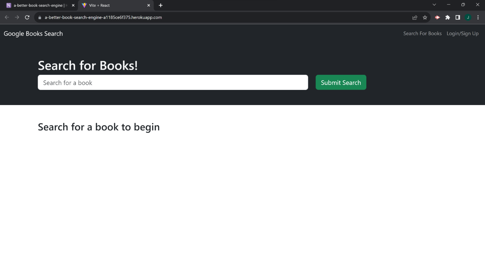

2.Even without login, the visitor can search for books by title/keyword:

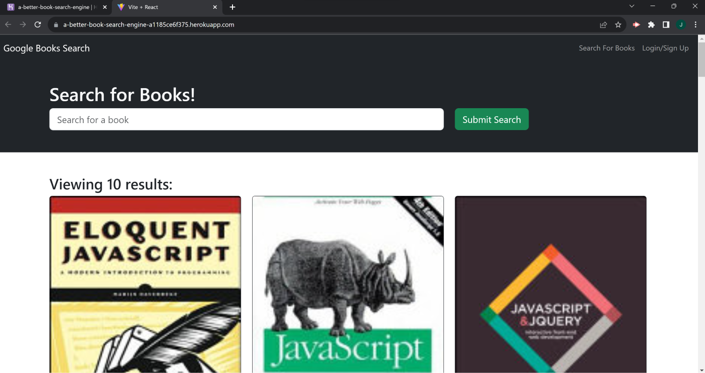

3.By clicking on the 'Login/Sign-Up' link in the nav-bar, a modal appears with those two options:

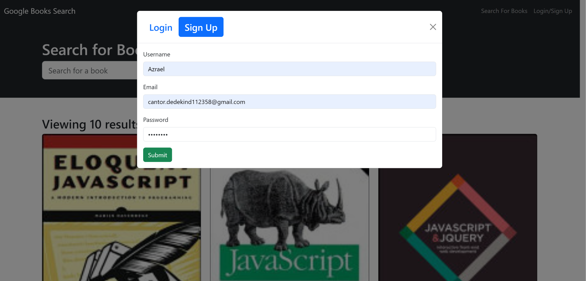

4.Once the visitor has signed-up (an email address with a valid pattern is required), when a book search is enacted, it will be possible to save a particular book in the 'Saved Books' list:

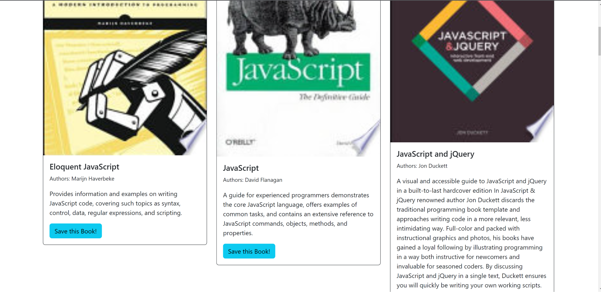

5.The 'Saved Books' list, which can be accesed by clicking the nav-link with that same name, actually starts empty. Notice that the links in the nav-bar have changed:

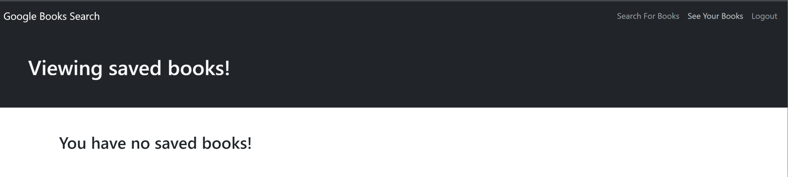

6.When the user clicks the button that says 'Save this Book!', its text content changes to the following:

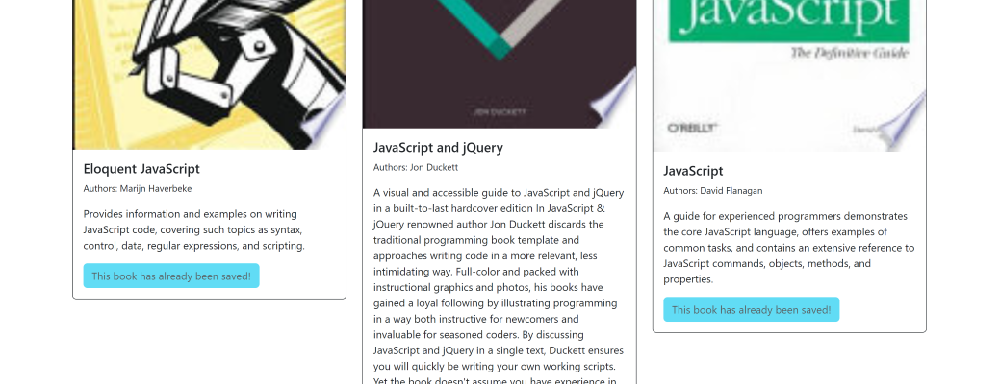

7.Now the visitor can retrieve info about the already saved books by 'navigating' to the 'Saved Books' page:

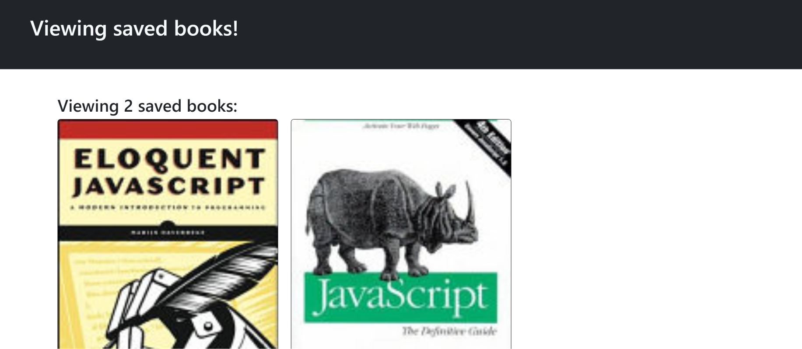

8.Books can be deleted from the 'Saved Books' list by clicking the 'Delete this Book' button:

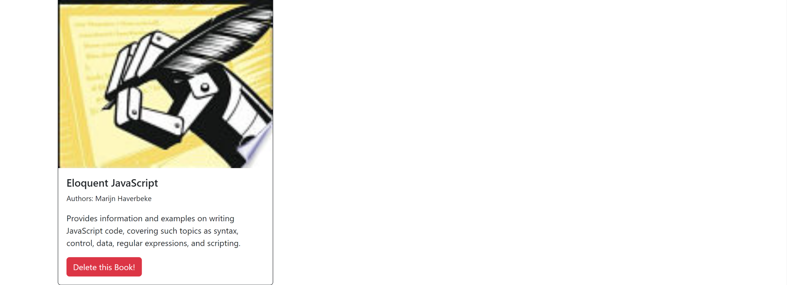

9.If the user opens Chrome Dev Tools, they can verify that a 'saved_books' and an 'id_token' key have been added to localStorage in order to store data about the books saved by the user(in an array containing the 'bookId' given by the Google Books API) and a Jason Web Token that is generated when the user session starts, respectively:

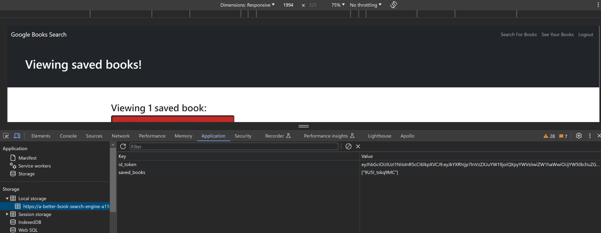

10.By copying and pasting the value of the 'id_token' in the 'Encoded' box of jwt.io, we can decode the 'base64UrlEncode' string , revealing info about the user (including the '_id' unique key generated by MongoDB):

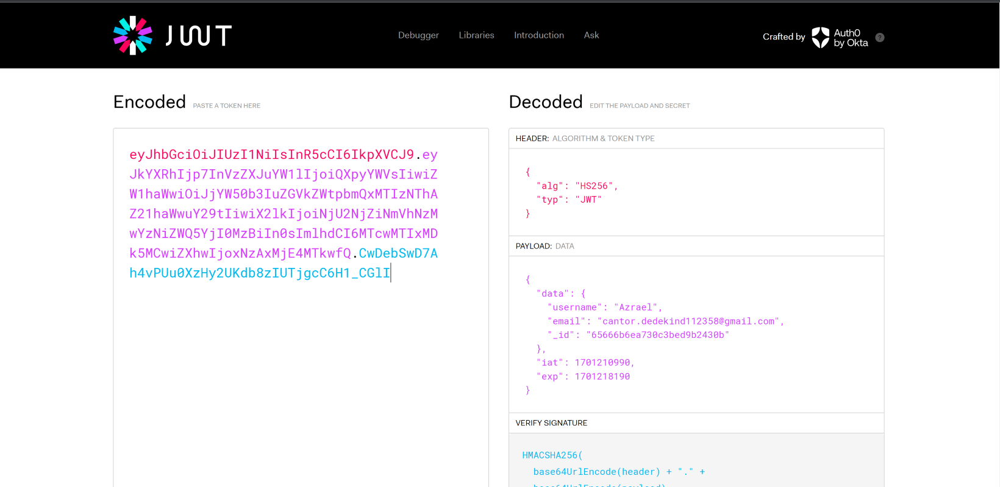

11.By going to the 'Database-As-A-Service' MongoDB Atlas website, we can make sure that relevant user data is persisted to the 'googlebooks' database:

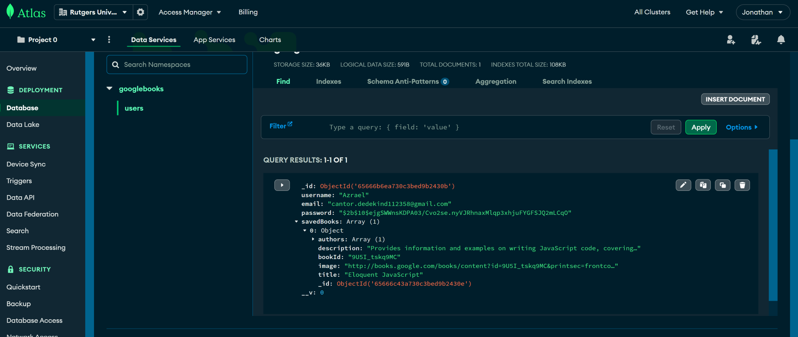

12.If something is wrong with a visitor's credentials, a generic message on top and a more-detailed one at the bottom will say so:

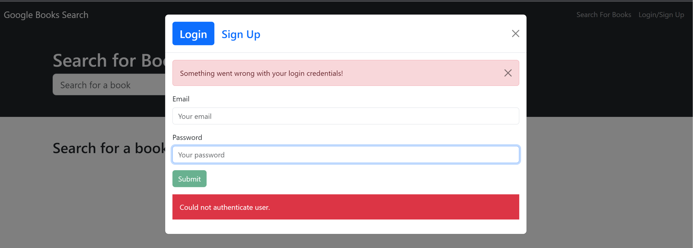

13.If after having clicked the 'Logout' option, a user logs-in again, a new Jason Web Token gets issued, but the info that gets persisted to the database is still the same:

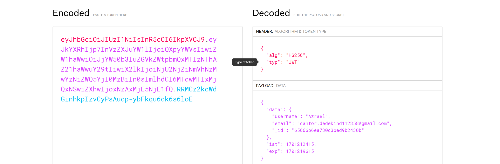

## Credits

The present app is a refactoring done by Jonathan Maldonado Guemarez.

The application was deployed using MongoDB Atlas and the Heroku platform and can be found at <https://a-better-book-search-engine-a1185ce6f375.herokuapp.com/>.

The GitHub repo of the reafactored app that uses the GraphQL API can be found at: <https://github.com/jguemarez/BookSearchEngine>.

The repo with the source code for the original app by Xandromus (which employs a REST API) can be found at: <https://github.com/coding-boot-camp/solid-broccoli>

The .gitignore file was lifted from the GitLab class repo found at: <https://git.bootcampcontent.com>.

This back-end of this app works in the Node.js JavaScript runtime environment. The latest stable (recommended version) can be found at: <https://nodejs.org/en/download>

We use npm for the specification (semantic versioning) of the app's dependencies and their installation. Here is the URL for the official site of the npm registry: <https://www.npmjs.com>
Here are the dependencies for the development and production environments that we added, including links to find their most recent versions:

Dev-dependencies:

Root-level:

1. Concurrently: "^5.1.0". Allows for the simultaneous execution of npm scripts/commands in the terminal by using a promise-based approach.
<https://www.npmjs.com/package/concurrently>

Server:

1. Nodemon: "^2.0.3". Used to continuously track the changes to the .js and .json file while coding and debugging, so as not to have to manually stop and restart the Express server from listening at the designated port after each change.
<https://www.npmjs.com/package/nodemon>

Client:

1. TypeScript definitions for React/ React-DOM:

"@types/react": "^18.0.28" <https://www.npmjs.com/package/@types/react>,

"@types/react-dom": "^18.0.11"<https://www.npmjs.com/package/@types/react-dom>

2. Default Vite plugin for React projects: "@vitejs/plugin-react": "^4.0.0"

<https://www.npmjs.com/package/@vitejs/plugin-react>,

3. ES-Lint related dev-dependencies: Facilitate the uniform styling of the code.

<https://eslint.org/>

"eslint": "^8.38.0" ,
"eslint-plugin-react": "^7.32.2",
"eslint-plugin-react-hooks": "^4.6.0",
"eslint-plugin-react-refresh": "^0.3.4"

4. Vite: "^4.3.2". Front-end build tool with many features for both development and production environments.
<https://www.npmjs.com/package/vite>

Dependencies:

Server:

1. Apollo server: "^4.7.1". Open-source GraphQL server that we use in conjunction with the Express.js server.
<https://www.npmjs.com/package/apollo-server>

2. Bcrypt: "^4.0.1". Helps with the hash-algorithm-based encryption of passwords and their subsequent verification for authentication purposes.
<https://www.npmjs.com/package/bcrypt>

3. DotEnv: "^16.3.1". It helps to assign and save values for environmental variables during development.
<https://www.npmjs.com/package/dotenv>

4. Express: "^4.17.1". In order to create and work with servers, middleware, routers, etc.
<https://www.npmjs.com/package/express>

5. GraphQL: "^16.6.0". Facilitates the use of the GraphQl query language within JS files.
<https://www.npmjs.com/package/graphql>

6. JsonWebToken: "^8.5.1". Allows us to sign and verify JWTs within our script files.
<https://www.npmjs.com/package/jsonwebtoken>

7. Mongodb: "^6.3.0". Driver for MongoDB to be used within the Node environment.
<https://www.npmjs.com/package/mongodb>

8. Mongoose: "^7.0.2". In order to use ODM with the MongoDB NoSQL database. Synchronizing the models and schema allows us to structure our documents and subdocuments, to validate the values of certain fields, to transform/format the value of some of those fields, and to compute some additional properties that do not persist to the database. Everything is done using back-end JavaScript.
<https://www.npmjs.com/package/mongoose>

Client:

1. Apollo client: "^3.7.14". When integrated with React, it allows the rendering of components that retrieve data using the GraphQL API.
<https://www.npmjs.com/package/apollo-client>

2. GraphQL: "^16.6.0". Facilitates the use of the GraphQl query language within JS files.
<https://www.npmjs.com/package/graphql>

3. Bootstrap: "^5.2.3". To be able to import the Bootstrap libraries without depending on Content Delivery Networks.
<https://www.npmjs.com/package/bootstrap>

4. JWT-Decode: "^3.1.2". Permits the decoding of JSON Web Tokens within our app in order to get profile info of the current user/'me'.
<https://www.npmjs.com/package/jwt-decode>

5. React: "^18.2.0". Provides the means to build React components.
<https://www.npmjs.com/package/react>

6. React-Bootstrap: "^2.7.4". Provides ready-made (but customizable) React components and styling utilities/classes.
<https://www.npmjs.com/package/react-bootstrap>

7. React-Dom: "^18.2.0". Facilitates the rendering of React components as well as manipulations on the virtual DOM.
<https://www.npmjs.com/package/react-dom>

8. React-Router-Dom: "^6.11.2". Allows client-side routing within our React application.
<https://www.npmjs.com/package/react-router-dom>

## How to Contribute

If you want to contribute, feel free to fork the repo, modify the repo on your local machine and then open a pull request. That way I can review the changes before deciding whether to merge them in the codebase or not.

## Tests

The refactored app was tested so that no error messages appeared in the Google Chrome DevTools' console. However, deployment to Heroku proved to be something of a challenge due to my ignorance of MongoDB Atlas settings. In the future, some tests for the functional React components could be devised using Jest or some other testing framework.

## Questions

The GitHub profile name of Jonathan Maldonado is "jguemarez" and you can checkout his profile at: <https://www.github.com/jguemarez>.
For further questions and comments, you can mail him to the following address: <cantor.dedekind112358@gmail.com>.

## License

This is an open-source project under the terms of agreement provided by the MIT license.
For more information, click on the following link: <https://opensource.org/license/mit>
